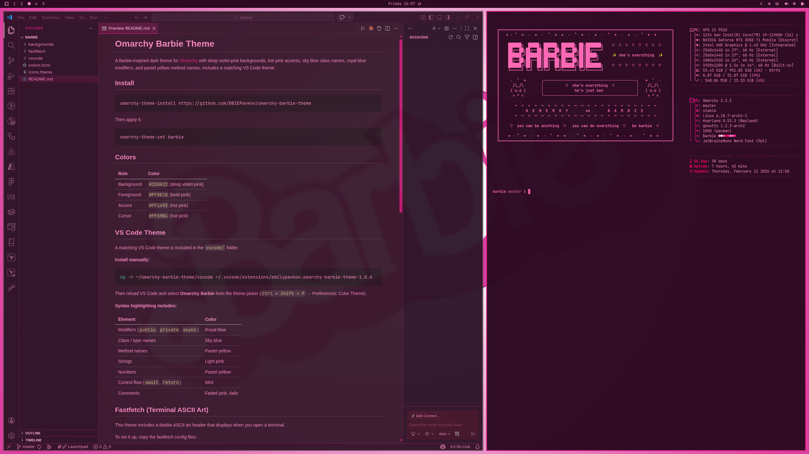

# Omarchy Barbie Theme

A Barbie-inspired dark theme for [Omarchy](https://omarchy.org/) with deep violet-pink backgrounds, hot pink accents, sky blue class names, royal blue modifiers, and pastel yellow method names. Includes a matching VS Code theme.



## Install

```bash
omarchy-theme-install https://github.com/BBIEPavkov/omarchy-barbie-theme
```

Then apply it:

```bash
omarchy-theme-set barbie
```

## Colors

| Role | Color |
|------|-------|
| Background | `#2D0A22` (deep violet-pink) |
| Foreground | `#FF8EC8` (bold pink) |
| Accent | `#FF1493` (hot pink) |
| Cursor | `#FF69B4` (hot pink) |

## VS Code Theme

A matching VS Code theme is included in the `vscode/` folder.

**Install manually:**

```bash
ln -s ~/.config/omarchy/themes/barbie/vscode ~/.vscode/extensions/omarchy-barbie-theme
```

Then reload VS Code and select **Omarchy Barbie** from the theme picker (`Ctrl + Shift + P` → Preferences: Color Theme).

**Syntax highlighting includes:**
| Element | Color |
|---------|-------|
| Modifiers (`public`, `private`, `async`) | Royal blue |
| Class / type names | Sky blue |
| Method names | Pastel yellow |
| Strings | Light pink |
| Numbers | Pastel yellow |
| Control flow (`await`, `return`) | Mint |
| Comments | Faded pink, italic |

## Fastfetch (Terminal ASCII Art)

This theme includes a Barbie ASCII art header that displays when you open a terminal.

To set it up, copy the fastfetch config files:

```bash
cp ~/.config/omarchy/themes/barbie/fastfetch/config.jsonc ~/.config/fastfetch/config.jsonc
```

Then add fastfetch to your `~/.bashrc`:

```bash
echo "fastfetch" >> ~/.bashrc
```

> **Note:** This will replace your existing fastfetch config. Back it up first if you want to keep it:
> ```bash
> cp ~/.config/fastfetch/config.jsonc ~/.config/fastfetch/config.jsonc.bak
> ```

## Wallpapers

Add your own Barbie-themed wallpapers to `~/.config/omarchy/themes/barbie/backgrounds/` and cycle through them with `Super + Ctrl + Space`.
