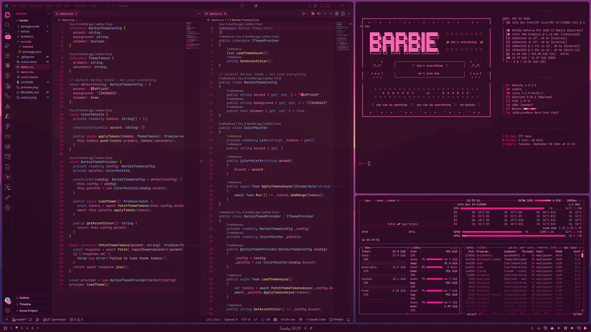
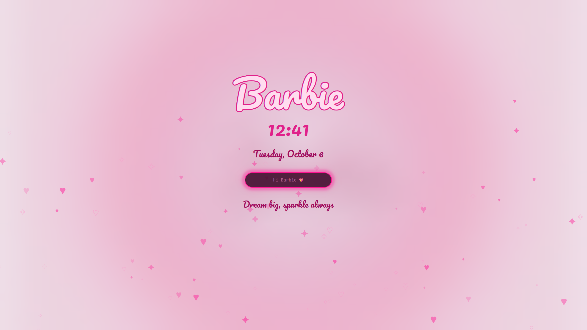

# Omarchy Barbie Theme

A Barbie-inspired dark theme for [Omarchy](https://omarchy.org/) with deep violet-pink backgrounds, hot pink accents, sky blue class names, royal blue modifiers, and pastel yellow method names. Includes a matching VS Code theme.



## Install

```bash
omarchy theme install https://github.com/BBIEPavkov/omarchy-barbie-theme
```

Then apply it:

```bash
omarchy theme set barbie
```

Requires Omarchy 4 (Quattro) and the `Yaru-magenta` icon theme.

## Light Mode

For daytime, use the light [Omarchy Barbie Malibu theme](https://github.com/BBIEPavkov/omarchy-barbie-malibu-theme): pastel pink backgrounds with deep berry text and ocean blue highlights.

```bash
omarchy theme install https://github.com/BBIEPavkov/omarchy-barbie-malibu-theme
omarchy theme set barbie-malibu
```

Switch between the two any time with `omarchy theme set barbie` and `omarchy theme set barbie-malibu`.

## Colors

| Role | Color |
|------|-------|
| Background | `#2D0A22` (deep violet-pink) |
| Foreground | `#FF8EC8` (bold pink) |
| Accent | `#FF1493` (hot pink) |
| Cursor | `#FF69B4` (hot pink) |

## VS Code Theme

A matching VS Code theme is included in the `vscode/` folder.

**Install manually:**

```bash
ln -s ~/.config/omarchy/themes/barbie/vscode ~/.vscode/extensions/omarchy-barbie-theme
```

Then reload VS Code and select **Omarchy Barbie** from the theme picker (`Ctrl + Shift + P` → Preferences: Color Theme).

**Syntax highlighting includes:**
| Element | Color |
|---------|-------|
| Modifiers (`public`, `private`, `async`) | Royal blue |
| Class / type names | Sky blue |
| Method names | Pastel yellow |
| Strings | Light pink |
| Numbers | Pastel yellow |
| Control flow (`await`, `return`) | Mint |
| Comments | Faded pink, italic |

## Obsidian

Omarchy themes Obsidian automatically. This theme adds heart bullet points, a heart before each top-level heading, pink highlights, and dividers made of hearts.

## Discord

For [Vencord](https://vencord.dev) or Vesktop: copy `vencord.theme.css` into Vencord's themes folder, then turn it on under Settings → Themes.

```bash
cp ~/.config/omarchy/themes/barbie/vencord.theme.css ~/.config/Vencord/themes/barbie.theme.css
```

## Fastfetch (Terminal ASCII Art)

This theme includes a Barbie ASCII art header that displays when you open a terminal.

To set it up, copy the fastfetch config files:

```bash
cp ~/.config/omarchy/themes/barbie/fastfetch/config.jsonc ~/.config/fastfetch/config.jsonc
```

Then add fastfetch to your `~/.bashrc`:

```bash
echo "fastfetch" >> ~/.bashrc
```

> **Note:** This will replace your existing fastfetch config. Back it up first if you want to keep it:
> ```bash
> cp ~/.config/fastfetch/config.jsonc ~/.config/fastfetch/config.jsonc.bak
> ```

## Extras

The theme sets colors, wallpapers, a hot pink window border, and the boot screen logo. Everything else is optional and installed by a script that asks before each piece:

```bash
~/.config/omarchy/themes/barbie/extras/install.sh
```



| Extra | What you get |
|-------|--------------|
| Lock screen | Shimmering Barbie logo, script clock and date, floating hearts and sparkles, heart password dots, a sparkle trail and click bursts, sassier messages on each wrong password, confetti on unlock. The layout drifts slowly to avoid burn-in. |
| Bar | Clock in a script font, a ♥ on the current workspace, and a slightly taller bar |
| Popups | Volume and brightness levels shown as hearts, and a ♥ on every notification |
| Cursor | Hot pink cursor (a recolor of [Catppuccin Cursors](https://github.com/catppuccin/cursors), GPL-2.0) |
| Windows | Rounded corners, a soft pink glow around the focused window, and bouncy open/close animations |
| Daily wallpaper | Switches to the next Barbie wallpaper once a day |
| Terminal prompt | Pink ♥ before the folder name, 💔 after a failed command ([Starship](https://starship.rs)) |
| Launcher | "Where to, Barbie…" as the menu prompt |
| Boot and login screens | Barbie logo on the boot password screen and the login screen (asks for your password) |

To undo all of it and get Omarchy's built-ins back:

```bash
~/.config/omarchy/themes/barbie/extras/uninstall.sh
```

To customize the lock screen, edit `~/.config/omarchy/plugins/emilypavkov.lock/LockView.qml` (messages, number of hearts) or `Service.qml` (wrong-password messages), then run `omarchy restart shell`.

## Wallpapers

Cycle through them with `Super + Ctrl + Space` or `omarchy theme bg next`. Add your own to `~/.config/omarchy/backgrounds/barbie/`; that folder survives theme updates.

Photos from [Unsplash](https://unsplash.com), free to use under the [Unsplash License](https://unsplash.com/license):

| File | Photographer |
|------|--------------|
| `palms-purple-sky.jpg` | [Tim Mossholder](https://unsplash.com/photos/YMtLdvIQtu0) |
| `pink-blossoms.jpg` | [Mi Min](https://unsplash.com/photos/pkpqoBp11Jc) |
| `pink-building-palms.jpg` | [Caroline Ross](https://unsplash.com/photos/qkZbgZ9dM8c) |
| `pink-clouds.jpg` | [Xinyi Wen](https://unsplash.com/photos/qjCHPZbeXCQ) |
| `pink-paint-swirl.jpg` | [Pawel Czerwinski](https://unsplash.com/photos/6Oyd_q79z2M) |
| `pink-peach-gradient.jpg` | [Ikhlas](https://unsplash.com/photos/MzfOPW5Tb3M) |
| `pink-sky-bridge.jpg` | [Anders Jildén](https://unsplash.com/photos/AkUR27wtaxs) |

## Fonts

The lock screen bundles [Pacifico](https://github.com/googlefonts/Pacifico) and the bar clock bundles [Dancing Script](https://github.com/googlefonts/DancingScript), both under the SIL Open Font License (see each plugin's `OFL.txt`). The plugins are based on Omarchy's built-in ones ([MIT](https://github.com/basecamp/omarchy/blob/master/LICENSE)).

## Disclaimer

Barbie is a trademark of Mattel, Inc. This is an unofficial fan theme and is not affiliated with or endorsed by Mattel.
